# Estúdio Âncora

Estúdio Âncora is a native Android mobile application designed for quick and intuitive booking and
schedule management for barbershops. Built with **Kotlin** and **Jetpack Compose**, it aims to
provide a professional management solution with **zero initial cost**, allowing small business
owners to transition from manual scheduling to a digital system without financial barriers.

---

## 📸 Screenshots

### Customer App

|                                                     Booking                                                      |                                 Form                                 |                                  History                                   |
|:----------------------------------------------------------------------------------------------------------------:|:--------------------------------------------------------------------:|:--------------------------------------------------------------------------:|
|                   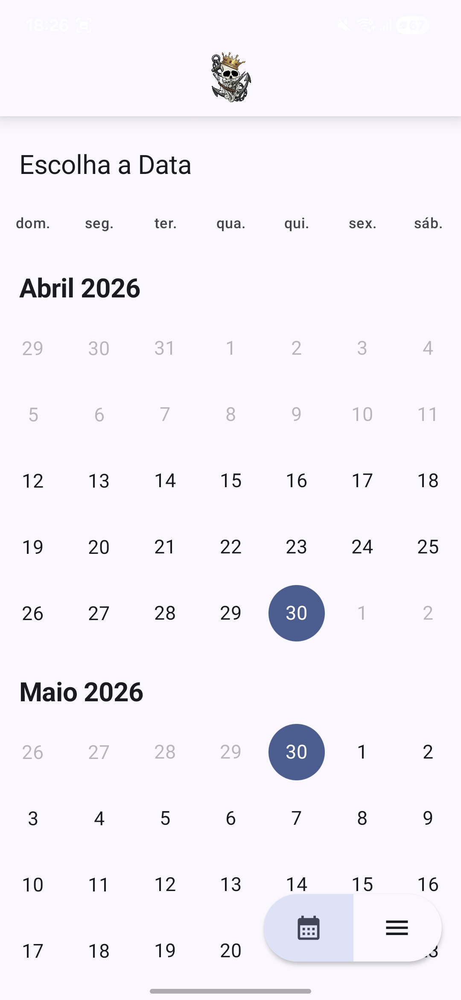                    | 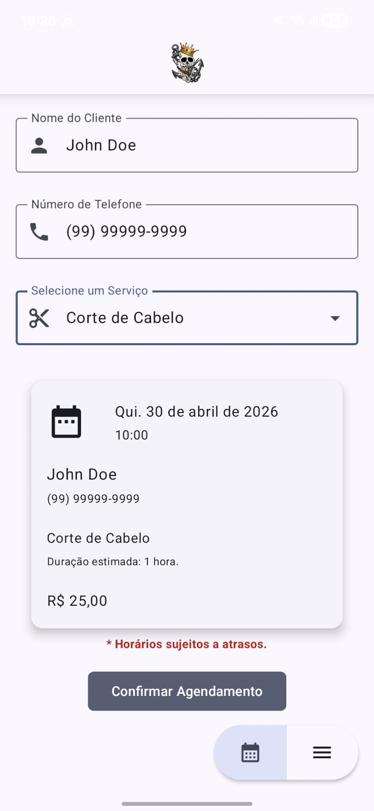 | 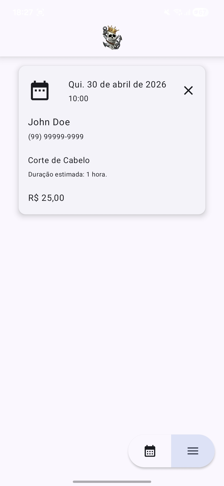 |
| 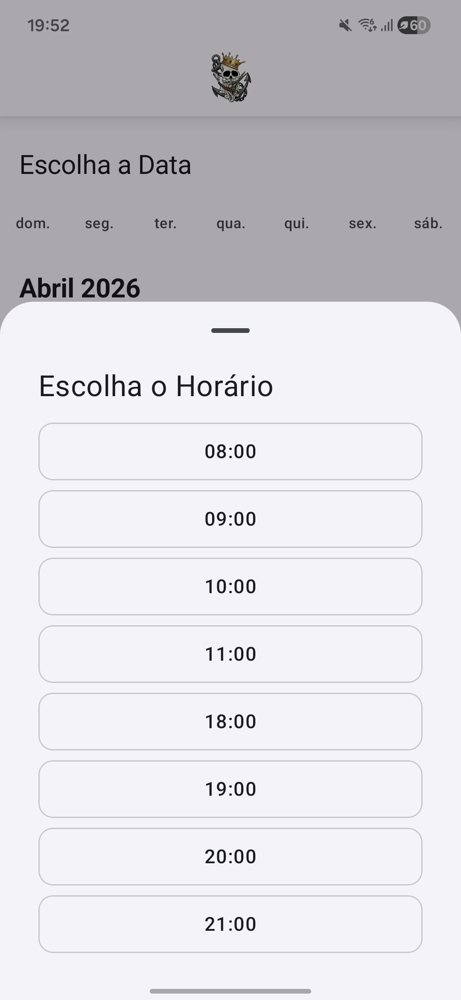 |                                                                      |                                                                            |

### Admin App

|                                                    Schedule                                                    |                                                History                                                |                                            Available Times                                            |                                         Services                                          |
|:--------------------------------------------------------------------------------------------------------------:|:-----------------------------------------------------------------------------------------------------:|:-----------------------------------------------------------------------------------------------------:|:-----------------------------------------------------------------------------------------:|
|                   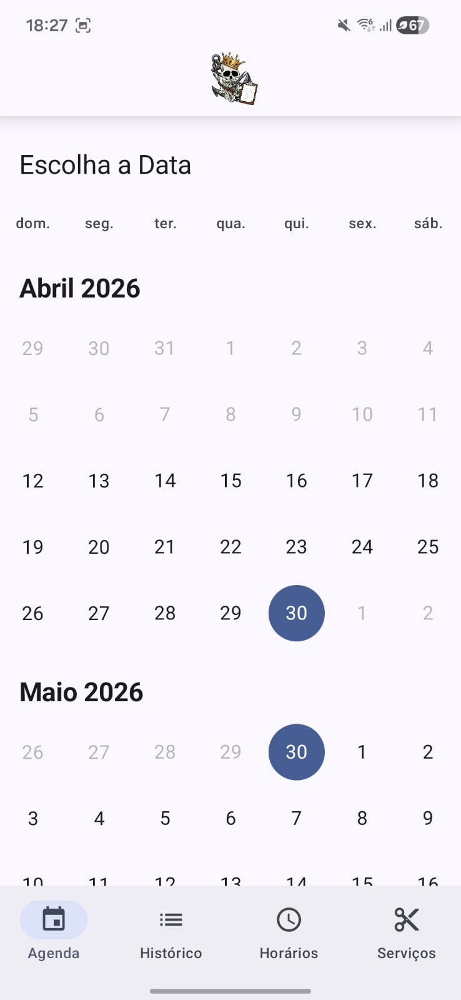                    |                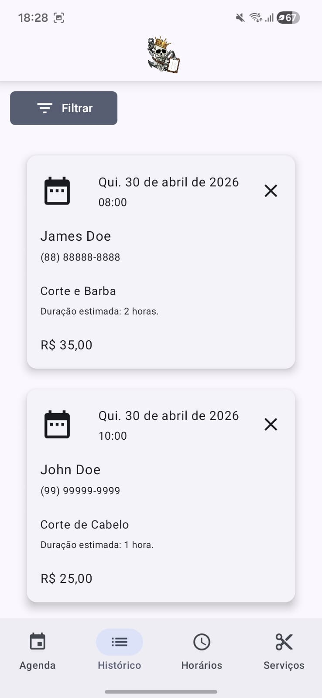                |                 |         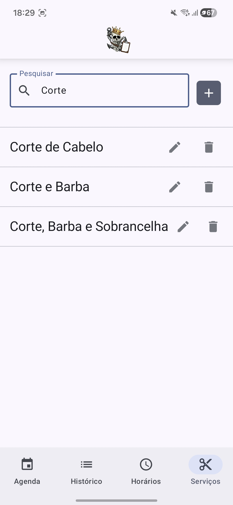         |
| 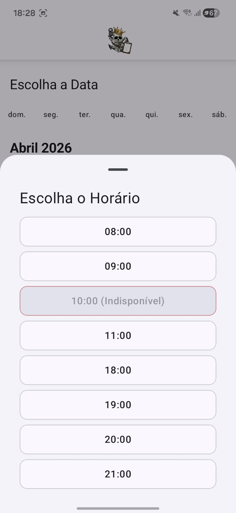 | 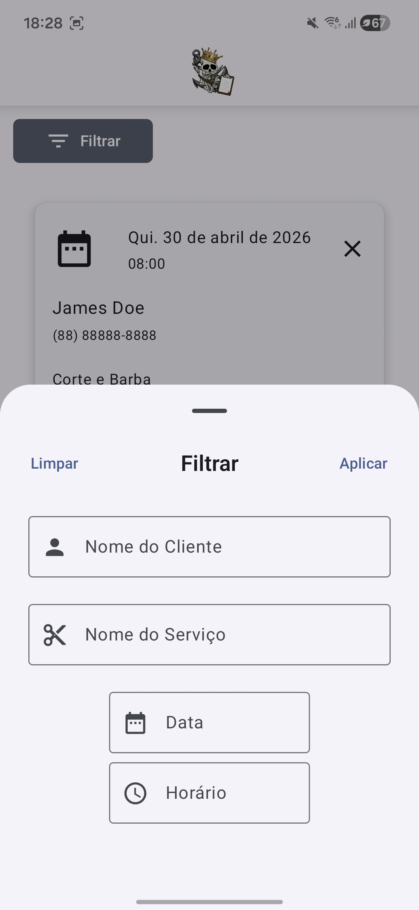 | 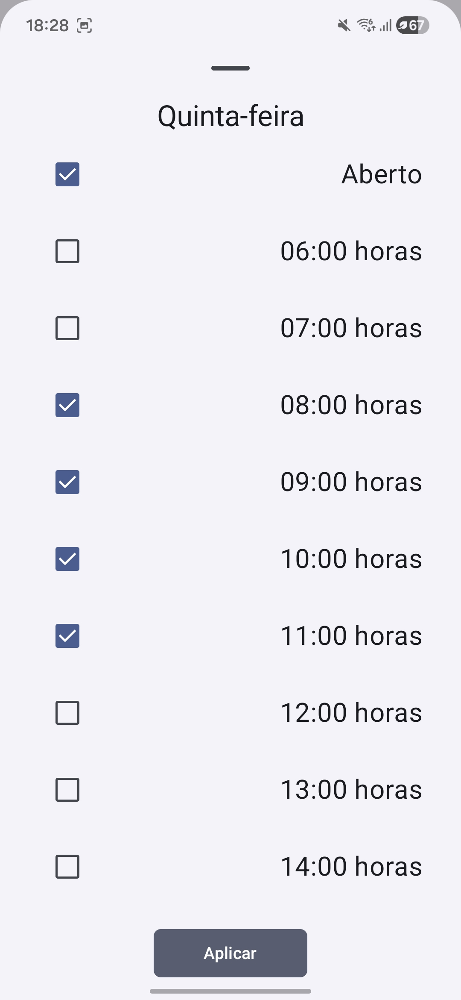 | 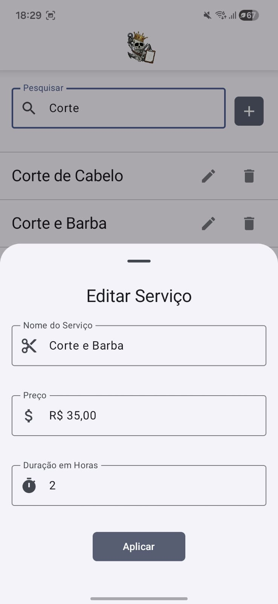 |

---

## ✨ Key Features

- **Client Booking:** A streamlined interface for customers to select services and book available
  time slots in seconds.
- **Admin Management:** A dedicated module for barbershop owners to manage the full schedule,
  services, and business hours.
- **Frictionless Experience:** Uses **Firebase Anonymous Authentication** to allow immediate use
  without complex sign-up flows for customers.
- **Cost Efficiency:** Architected to run strictly within the **Firebase Spark (Free) Plan**,
  ensuring zero operational costs for small businesses.
- **Native Performance:** Fully built with modern Android standards (Material 3, Jetpack Compose)
  for a fluid and responsive UI.

---

## 🛠 Tech Stack

- **Language:** [Kotlin](https://kotlinlang.org/)
- **UI Framework:** [Jetpack Compose](https://developer.android.com/jetpack/compose) (with Material3)
- **Backend:** [Firebase](https://firebase.google.com/) (Firestore, Anonymous Auth)
- **Local Storage:** [Jetpack DataStore](https://developer.android.com/topic/libraries/architecture/datastore)
- **Architecture:** Modified MVC with a Multi-Module Gradle setup.
- **Asynchrony:** [Kotlin Coroutines](https://kotlinlang.org/docs/coroutines-overview.html) & [Flow](https://kotlinlang.org/docs/flow.html).
- **IDE:** Android Studio

---

## 🏗 Architecture & Modules

The project follows a modular architecture to maximize code reuse between the Customer (`:app`) and
Admin (`:admin`) applications.

- **`:app`**: The customer-facing application.
- **`:admin`**: The management application for owners. Contains all project tests.
- **`:shared`**: Reusable UI components, themes, and shared ViewModels/Screens.
- **`:core`**: The business heart. Contains Domain entities, Firestore Models, and Services.

### 📚 Documentation

Detailed project documentation can be found in the [docs/](docs/) directory:

- [Architecture & Data Flow](docs/architecture.md)
- [Authentication Strategy](docs/auth.md)
- [Database Structure](docs/database.md)
- [Module Responsibilities](docs/modules.md)
- [Testing Strategy](docs/testing.md)

---

## 🚀 Getting Started

### Prerequisites

- [Android Studio Ladybug](https://developer.android.com/studio) or newer.
- JDK 17.
- A Firebase project (configured with Firestore and Anonymous Auth).

### Setup

1. **Clone the repository:**
   ```bash
   git clone https://github.com/your-username/estudio-ancora.git
   ```
2. **Add Firebase configuration:**
   The project uses different build flavors (`dev` and `prod`). Place your `google-services.json`
   file in the appropriate directory for both modules:
    - **Customer App:** `app/src/dev/` or `app/src/prod/`
    - **Admin App:** `admin/src/dev/` or `admin/src/prod/`
3. **Build the project:**
   ```bash
   ./gradlew build
   ```
4. **Run the apps:**
    - For the customer app: Use the `:app` configuration.
    - For the admin app: Use the `:admin` configuration.

---

## 🧪 Testing

We prioritize reliability. All tests (Unit and Instrumented) are centralized in the `:admin` module.

### Unit Tests

Focused on business logic, mapping, and validators. These run quickly on your local machine:

```bash
./gradlew :admin:test
```

### Instrumented Tests

Focused on integration with Firebase and local persistence. These require a connected device or
emulator (runs on the `dev` flavor):

```bash
./gradlew :admin:connectedDevDebugAndroidTest
```

For more details on our testing strategy, including how to run data seeders, see
the [Testing Documentation](docs/testing.md).

---

## ⚖️ License

This project is licensed under the **GNU Affero General Public License v3.0 (AGPL-3.0)**. See
the [LICENSE](LICENSE) file for more details.

---

## 🤝 Contributing

Contributions are welcome! Whether it's reporting a bug, improving documentation, or submitting a
Pull Request, please feel free to check our issues or reach out.

---
