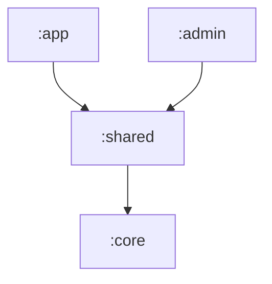

# Module Structure

This project utilizes a multi-module architecture to separate responsibilities, improve compilation time, and ensure that the business logic remains independent of the visual interface.

## Modules

### 1. `:core` (Android Library)
The "heart" of the application. It contains all the logic that does not directly depend on complex visual elements.
- **Responsibilities:**
    - `domain/`: Pure business entities (e.g., `Booking`, `Service`).
    - `models/`: Data access, Firestore, and DTOs.
    - `services/`: Business rules and orchestration (e.g., `BookingService`).
    - `libs/`: Infrastructure configurations (Firestore, DataStore).
    - `validators/`: Form and data validation logic.
    - `core.states/`: Application state definitions (Sealed Interfaces and Data Classes).
- **Dependencies:** Firebase, Coroutines, DataStore.

### 2. `:shared` (Android Library)
Resources and UI components that are reused by both the customer app and the admin app.
- **Responsibilities:**
    - `views/`: Themes (Theme.kt), Colors (Color.kt), and Typography (Type.kt).
    - `utils/`: Currency and date formatters, and visual transformations.
    - Global Compose components.
- **Dependencies:** Depends on `:core` (via `api`) and Jetpack Compose.

### 3. `:app` (Android Application)
The main application intended for the barbershop's customers.
- **Responsibilities:**
    - Booking, history, and customer profile screens.
    - ViewModels specific to the customer journey.
- **Dependencies:** Depends on `:shared`.

### 4. `:admin` (Android Application)
The management application intended for the owner/administrator.
- **Responsibilities:**
    - Time management, general schedule view, and service configuration.
    - ViewModels specific to administration.
- **Dependencies:** Depends on `:shared`.

## Dependency Hierarchy

Communication between modules follows this flow:

> **Technical Note:** The `:shared` module uses the `api(project(":core"))` configuration. This means any module that depends on `:shared` will have automatic access to the classes in `:core` without needing to import it explicitly.

## Benefits of this Structure
1. **Isolation:** Changes in the admin UI do not affect the customer app.
2. **Reuse:** All Firebase communication logic is in one place (`:core`).
3. **Testability:** It is possible to test `:core` in isolation without loading UI libraries.
