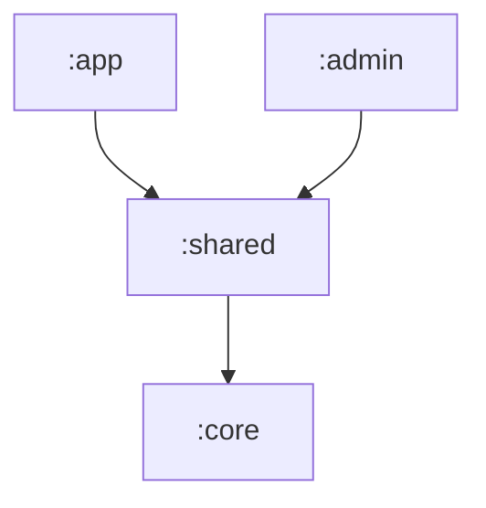

# Module Structure

This project utilizes a multi-module architecture to separate responsibilities, improve compilation time, and ensure that the business logic remains independent of the visual interface.

## Modules

### 1. `:core` (Android Library)
The "heart" of the application. It contains all the logic that does not directly depend on complex visual elements.
- **Responsibilities:**
    - `domain/`: Pure business entities (e.g., `Booking`, `Service`).
    - `models/`: Data access, Firestore, and DTOs.
    - `services/`: Business rules and orchestration (e.g., `BookingService`).
    - `libs/`: Infrastructure configurations (Firestore, DataStore).
    - `validators/`: Form and data validation logic.
    - `states/`: Global application state definitions (Sealed Interfaces and Data Classes).
- **Dependencies:** Firebase, Coroutines, DataStore.

### 2. `:shared` (Android Library)
Resources, UI components, and logic that are reused by both the customer app (`:app`) and the admin app (`:admin`).
- **Responsibilities:**
    - `views/`: Themes, Colors, and Typography.
    - `utils/`: Currency and date formatters.
    - `views/components/`: Global Compose components.
    - `views/screens/`: Shared screens used in both apps (e.g., `BookingForm`).
    - `views/viewModels/`: ViewModels associated with shared screens.
- **Dependencies:** Depends on `:core` (via `api`) and Jetpack Compose.

### 3. `:app` (Android Application)
The main application intended for the barbershop's customers.
- **Responsibilities:**
    - Customer-specific journey (e.g., personal booking history).
    - Customer-specific UI components (e.g., `AppAvailableTimesHandler`).
- **Dependencies:** Depends on `:shared`.

### 4. `:admin` (Android Application)
The management application intended for the owner/administrator.
- **Responsibilities:**
    - Administrative journey (e.g., management of all bookings, services, and business hours).
    - Admin-specific UI components (e.g., `AdminAvailableTimesHandler`).
    - **Test Centralization:** This module contains ALL the project's tests (Unit and Instrumented) to simplify the development and CI/CD environment.
- **Dependencies:** Depends on `:shared`.

## Dependency Hierarchy

Communication between modules follows this flow:

> **Technical Note:** The `:shared` module uses the `api(project(":core"))` configuration. This means any module that depends on `:shared` will have automatic access to the classes in `:core` without needing to import it explicitly.

## Benefits of this Structure
1. **Isolation:** Changes in the admin UI do not affect the customer app.
2. **Reuse:** All Firebase communication logic is in one place (`:core`). Shared user flows are in `:shared`.
3. **Testability:** It is possible to test `:core` and `:shared` logic through the tests centralized in `:admin`.
