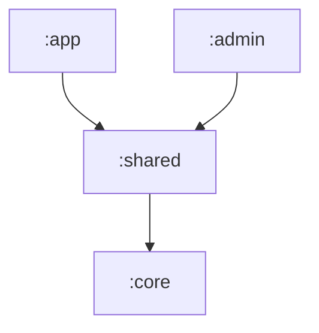

# Estrutura de Módulos

Este projeto utiliza uma arquitetura multi-módulo para separar responsabilidades, melhorar o tempo de compilação e garantir que a lógica de negócio seja independente da interface visual.

## Módulos

### 1. `:core` (Android Library)
O "coração" da aplicação. Contém toda a lógica que não depende diretamente de elementos visuais complexos.
- **Responsabilidades:**
    - `domain/`: Entidades puras de negócio (ex: `Booking`, `Service`).
    - `models/`: Acesso a dados, Firestore e DTOs.
    - `services/`: Regras de negócio e orquestração (ex: `BookingService`).
    - `libs/`: Configurações de infraestrutura (Firestore, DataStore).
    - `validators/`: Lógica de validação de formulários e dados.
    - `core.states/`: Definições de estados da aplicação (Sealed Interfaces e Data Classes).
- **Dependências:** Firebase, Coroutines, DataStore.

### 2. `:shared` (Android Library)
Recursos e componentes de UI que são reaproveitados tanto pelo app do cliente quanto pelo admin.
- **Responsabilidades:**
    - `views/`: Temas (Theme.kt), Cores (Color.kt) e Tipografia (Type.kt).
    - `utils/`: Formatadores de moeda, data e transformações visuais.
    - Componentes Compose globais.
- **Dependências:** Depende de `:core` (via `api`) e Jetpack Compose.

### 3. `:app` (Android Application)
O aplicativo principal destinado aos clientes da barbearia.
- **Responsabilidades:**
    - Telas de agendamento, histórico e perfil do cliente.
    - ViewModels específicas da jornada do cliente.
- **Dependências:** Depende de `:shared`.

### 4. `:admin` (Android Application)
O aplicativo de gestão destinado ao proprietário/administrador.
- **Responsabilidades:**
    - Gestão de horários, visualização de agenda geral e configuração de serviços.
    - ViewModels específicas de administração.
- **Dependências:** Depende de `:shared`.

## Hierarquia de Dependências

A comunicação entre os módulos segue este fluxo:

> **Nota Técnica:** O módulo `:shared` utiliza a configuração `api(project(":core"))`. Isso significa que qualquer módulo que dependa de `:shared` terá acesso automático às classes do `:core`, sem a necessidade de importá-lo explicitamente.

## Benefícios desta Estrutura
1. **Isolamento:** Alterações na UI do admin não afetam o app do cliente.
2. **Reutilização:** Toda a lógica de comunicação com o Firebase está em um só lugar (`:core`).
3. **Testabilidade:** É possível testar o `:core` de forma isolada, sem carregar bibliotecas de UI.
